# LiteParse

[](https://github.com/run-llama/liteparse/actions/workflows/ci.yml)
|
[](https://crates.io/crates/liteparse)
|
[](https://www.npmjs.com/package/@llamaindex/liteparse)
|
[](https://www.npmjs.com/package/@llamaindex/liteparse-wasm)
|
[](https://pypi.org/project/liteparse/)
|
[](https://opensource.org/licenses/Apache-2.0)
|
[文档](https://developers.llamaindex.ai/liteparse/)

[English](README.md) | 简体中文


> 在找 LiteParse V1？请访问 [旧版代码仓库](https://github.com/run-llama/liteparse/tree/logan/liteparse-v1)。

LiteParse 是一款独立的开源 PDF 解析工具，专注于**快速、轻量**的文档解析。它能输出高质量的、带有标注（bounding box）的空间文本信息，无需依赖任何闭源大模型或云端服务，所有处理都在本地完成。

**本地解析能力不够用？**
对于复杂文档（密集表格、多栏布局、图表、手写文字或扫描版 PDF），我们的云端文档解析工具 [LlamaParse](https://developers.llamaindex.ai/python/cloud/llamaparse/?utm_source=github&utm_medium=liteparse) 能给出明显更好的结果。它专为生产级文档处理流水线设计，会替你搞定那些棘手的情况，让模型直接拿到干净、结构化的数据和 markdown。

>  [免费注册 LlamaParse](https://cloud.llamaindex.ai?utm_source=github&utm_medium=liteparse)

## 概览

- **快速文本解析**：基于 PDFium 的空间文本解析
- **灵活的 OCR 体系**：
  - **内置**：Tesseract（开箱即用，已随库打包）
  - **HTTP 服务**：可接入任意 OCR 服务（EasyOCR、PaddleOCR 或自建服务）
  - **标准化 API**：简洁、定义清晰的 OCR API 规范
- **页面截图生成**：为 LLM 智能体生成高质量的页面截图
- **多种输出格式**：JSON 和纯文本
- **边界框信息**：精确的文本位置坐标
- **多语言绑定**：可在 Rust、Node.js / TypeScript、Python 以及浏览器（WASM）中使用
- **跨平台**：支持 Linux、macOS（Intel / ARM）和 Windows

```mermaid
flowchart LR
      subgraph Input["Input Formats"]
          direction TB
          PDF["PDF"]
          DOCX["DOCX"]
          XLSX["XLSX"]
          PPTX["PPTX"]
          IMG["Images"]
      end

      subgraph Core["Rust Core"]
          direction TB
          CONV["Format Conversion\nLibreOffice / image/resvg/usvg rust crates"]
          EXTRACT["Text Extraction\nPDFium C library"]
          OCR["Selective OCR\nTesseract / HTTP / Custom"]
          MERGE["OCR Merge\nNative text + OCR results"]
          PROJ["Grid Projection\nSpatial layout reconstruction"]
          CONV --> EXTRACT
          EXTRACT --> OCR --> MERGE --> PROJ
          EXTRACT --> MERGE
      end

      subgraph Output[" Output "]
          direction TB
          JSON["Structured JSON\ntext + bounding boxes"]
          TEXT["Plain Text\nlayout-preserved"]
          SCREEN["Screenshots\nPNG rendering"]
      end

      subgraph Bindings["Language Bindings"]
          direction TB
          NAPI["Node.js / TypeScript\nnapi-rs"]
          PYO3["Python\nPyO3"]
          WASM["Browser / WASM\nwasm-bindgen"]
          CLI["CLI\ncargo / npm / pip"]
          NAPI ~~~ PYO3 ~~~ WASM ~~~ CLI
      end

      PDF --> EXTRACT
      DOCX & XLSX & PPTX & IMG --> CONV
      PROJ --> JSON & TEXT & SCREEN
      JSON & TEXT & SCREEN --> Bindings

      style Input fill:#F5F5F5,color:#000000,stroke:#37D7FA,stroke-width:2px
      style Core fill:#F5F5F5,color:#000000,stroke:#3E18F9,stroke-width:2px
      style Output fill:#F5F5F5,color:#000000,stroke:#FF8705,stroke-width:2px
      style Bindings fill:#F5F5F5,color:#000000,stroke:#FF8DF2,stroke-width:2px

      style PDF fill:#96E7F9,color:#000000,stroke:#37D7FA,stroke-width:1px
      style DOCX fill:#96E7F9,color:#000000,stroke:#37D7FA,stroke-width:1px
      style XLSX fill:#96E7F9,color:#000000,stroke:#37D7FA,stroke-width:1px
      style PPTX fill:#96E7F9,color:#000000,stroke:#37D7FA,stroke-width:1px
      style IMG fill:#96E7F9,color:#000000,stroke:#37D7FA,stroke-width:1px

      style CONV fill:#92AEFF,color:#000000,stroke:#4B72FE,stroke-width:1px
      style EXTRACT fill:#92AEFF,color:#000000,stroke:#4B72FE,stroke-width:1px
      style OCR fill:#92AEFF,color:#000000,stroke:#4B72FE,stroke-width:1px
      style MERGE fill:#92AEFF,color:#000000,stroke:#4B72FE,stroke-width:1px
      style PROJ fill:#4B72FE,color:#FFFFFF,stroke:#3E18F9,stroke-width:2px

      style JSON fill:#FFBD74,color:#000000,stroke:#FF8705,stroke-width:1px
      style TEXT fill:#FFBD74,color:#000000,stroke:#FF8705,stroke-width:1px
      style SCREEN fill:#FFBD74,color:#000000,stroke:#FF8705,stroke-width:1px

      style NAPI fill:#FFBFF8,color:#000000,stroke:#FF8DF2,stroke-width:1px
      style PYO3 fill:#FFBFF8,color:#000000,stroke:#FF8DF2,stroke-width:1px
      style WASM fill:#FFBFF8,color:#000000,stroke:#FF8DF2,stroke-width:1px
      style CLI fill:#FFBFF8,color:#000000,stroke:#FF8DF2,stroke-width:1px
```



## 安装

可通过你常用的包管理器安装。除 WASM 之外，所有版本都附带相同的 `lit` 命令行工具。

| 语言 | 安装命令 | 库文档 |
|----------|---------|--------------|
| **Node.js / TypeScript** | `npm i @llamaindex/liteparse` | [Node.js README](packages/node/README.md) |
| **Python** | `pip install liteparse` | [Python README](packages/python/README.md) |
| **Rust** | `cargo install liteparse`（CLI）/ `cargo add liteparse`（库） | [Rust README（crates.io）](crates/liteparse/README.md) |
| **浏览器（WASM）** | `npm i @llamaindex/liteparse-wasm` | [WASM README](packages/wasm/README.md) |

### Agent Skill

你也可以把 `liteparse` 当作 agent skill 使用，通过 `skills` CLI 工具下载：

```bash
npx skills add run-llama/llamaparse-agent-skills --skill liteparse
```

或者直接把 [`SKILL.md`](https://github.com/run-llama/llamaparse-agent-skills/blob/main/skills/liteparse/SKILL.md) 文件复制到你自己的 skills 目录中。

## 命令行用法

无论通过 `npm`、`pip` 还是 `cargo install` 安装，命令行接口都是一致的。

### 解析文件

```bash
# 基本解析
lit parse document.pdf

# 指定输出格式
lit parse document.pdf --format json -o output.json

# 只解析特定页
lit parse document.pdf --target-pages "1-5,10,15-20"

# 关闭 OCR
lit parse document.pdf --no-ocr

# 解析远程 PDF
curl -sL https://example.com/report.pdf | lit parse -
```

### 批量解析

对整个目录中的文档进行批量解析：

```bash
lit batch-parse ./input-directory ./output-directory
```

### 生成截图

页面截图对 LLM 智能体很关键——它能让模型获取那些仅靠文本无法表达的视觉信息。

```bash
# 截图所有页
lit screenshot document.pdf -o ./screenshots

# 只截特定页
lit screenshot document.pdf --target-pages "1,3,5" -o ./screenshots

# 自定义 DPI
lit screenshot document.pdf --dpi 300 -o ./screenshots
```

### 命令行参考

#### Parse 命令

```
lit parse [OPTIONS] <file>

Options:
  -o, --output <file>          Output file path
      --format <format>        Output format: json|text [default: text]
      --no-ocr                 Disable OCR
      --ocr-language <lang>    OCR language, Tesseract format [default: eng]
      --ocr-server-url <url>   HTTP OCR server URL (uses Tesseract if not provided)
      --tessdata-path <path>   Path to tessdata directory
      --max-pages <n>          Max pages to parse [default: 1000]
      --target-pages <pages>   Pages to parse (e.g., "1-5,10,15-20")
      --dpi <dpi>              Rendering DPI [default: 150]
      --preserve-small-text    Keep very small text
      --password <password>    Password for encrypted documents
      --num-workers <n>        Concurrent OCR workers [default: CPU cores - 1]
  -q, --quiet                  Suppress progress output
  -h, --help                   Print help
```

#### Batch Parse 命令

```
lit batch-parse [OPTIONS] <input-dir> <output-dir>

Options:
      --format <format>        Output format: json|text [default: text]
      --no-ocr                 Disable OCR
      --ocr-language <lang>    OCR language [default: eng]
      --ocr-server-url <url>   HTTP OCR server URL
      --tessdata-path <path>   Path to tessdata directory
      --max-pages <n>          Max pages per file [default: 1000]
      --dpi <dpi>              Rendering DPI [default: 150]
      --recursive              Recursively search input directory
      --extension <ext>        Only process files with this extension (e.g., ".pdf")
      --password <password>    Password for encrypted documents
      --num-workers <n>        Concurrent OCR workers
  -q, --quiet                  Suppress progress output
  -h, --help                   Print help
```

#### Screenshot 命令

```
lit screenshot [OPTIONS] <file>

Options:
  -o, --output-dir <dir>       Output directory [default: ./screenshots]
      --target-pages <pages>   Pages to screenshot (e.g., "1,3,5" or "1-5")
      --dpi <dpi>              Rendering DPI [default: 150]
      --password <password>    Password for encrypted documents
  -q, --quiet                  Suppress progress output
  -h, --help                   Print help
```

## OCR 配置

### 默认方案：Tesseract

Tesseract 已经随库打包，开箱即用：

```bash
lit parse document.pdf                    # 默认启用 OCR
lit parse document.pdf --ocr-language fra # 指定识别语言
lit parse document.pdf --no-ocr           # 关闭 OCR
```

如果运行在离线或内网隔离环境，可以把 `TESSDATA_PREFIX` 指向一个预先准备好的、放有 `.traineddata` 文件的目录：

```bash
export TESSDATA_PREFIX=/path/to/tessdata
lit parse document.pdf --ocr-language eng
```

也可以直接通过命令行参数传入路径：

```bash
lit parse document.pdf --tessdata-path /path/to/tessdata
```

### 可选方案：HTTP OCR 服务

如果对识别精度或性能有更高要求，可以接入 HTTP OCR 服务。我们为几款常用 OCR 引擎提供了开箱即用的封装示例：

- [EasyOCR](ocr/easyocr/README.md)
- [PaddleOCR](ocr/paddleocr/README.md)

你也可以通过实现 LiteParse 简洁的 OCR API 规范（参考 [`OCR_API_SPEC.md`](OCR_API_SPEC.md)）来接入任何 OCR 服务。

接口要求：
- 提供 POST `/ocr` 端点
- 接收 `file` 和 `language` 参数
- 返回如下结构的 JSON：`{ results: [{ text, bbox: [x1,y1,x2,y2], confidence }] }`

## 多格式输入支持

LiteParse 支持**自动将多种文档格式转换为 PDF** 后再解析。

### 支持的输入格式

#### 办公文档（通过 LibreOffice）
- **Word**：`.doc`、`.docx`、`.docm`、`.odt`、`.rtf`、`.pages`
- **PowerPoint**：`.ppt`、`.pptx`、`.pptm`、`.odp`、`.key`
- **电子表格**：`.xls`、`.xlsx`、`.xlsm`、`.ods`、`.csv`、`.tsv`、`.numbers`

安装 LibreOffice 以启用自动转换：

```bash
# macOS
brew install --cask libreoffice

# Ubuntu/Debian
apt-get install libreoffice

# Windows
choco install libreoffice-fresh
```

> _Windows 上可能需要把 LibreOffice 的 program 目录（通常是 `C:\Program Files\LibreOffice\program`）加入 PATH。_

#### 图像
- **支持格式**：`.jpg`、`.jpeg`、`.png`、`.gif`、`.bmp`、`.tiff`、`.webp`、`.svg`

## 环境变量

| 变量 | 说明 |
|----------|-------------|
| `TESSDATA_PREFIX` | 指向存放 Tesseract `.traineddata` 文件的目录路径，用于离线或内网隔离环境。 |

## 开发

整个项目是一个 Rust workspace，包含核心库以及各个语言绑定子 crate。

```
crates/
├── liteparse/          # 核心库 + CLI 二进制
├── liteparse-napi/     # Node.js 绑定（napi-rs）
├── liteparse-python/   # Python 绑定（PyO3）
├── liteparse-wasm/     # WASM 绑定（wasm-bindgen）
├── pdfium/             # PDFium 的 Rust 封装
└── pdfium-sys/         # PDFium FFI 绑定
packages/
├── node/               # npm 包（TS 封装 + 原生二进制）
├── python/             # PyPI 包（Python 封装 + 原生二进制）
└── wasm/               # WASM npm 包
```

### 构建

```bash
# 构建 CLI
cargo build --release -p liteparse

# 构建 Node.js 绑定
cd packages/node && npm run build

# 构建 Python 绑定
cd packages/python && maturin develop --release

# 构建 WASM
cd packages/wasm && npm run build
```

我们提供了内容比较详尽的 `AGENTS.md` / `CLAUDE.md`，推荐配合代码 agent 一起开发时参考。

## 许可证

Apache 2.0

## 鸣谢

LiteParse 构建在以下项目之上：

- [PDFium](https://pdfium.googlesource.com/pdfium/) —— PDF 渲染与文本提取
- [Tesseract](https://github.com/tesseract-ocr/tesseract) —— OCR 引擎（通过 tesseract-rs 接入）
- [EasyOCR](https://github.com/JaidedAI/EasyOCR) —— HTTP OCR 服务（可选）
- [PaddleOCR](https://github.com/PaddlePaddle/PaddleOCR) —— HTTP OCR 服务（可选）
- [napi-rs](https://napi.rs/) —— Node.js 原生绑定
- [PyO3](https://pyo3.rs/) —— Python 原生绑定
- [wasm-bindgen](https://github.com/wasm-bindgen/wasm-bindgen) —— WebAssembly 绑定
